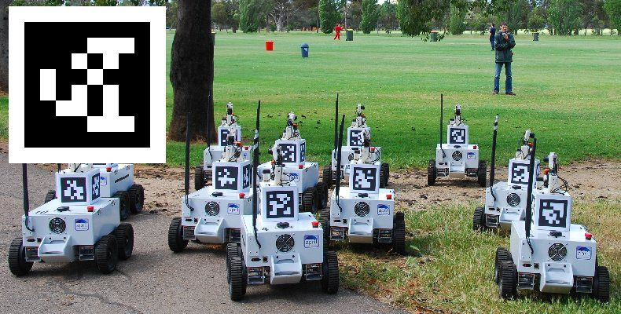

# Sprint 1 Iot

## Integrantes

| Nome                   |   RM   |
| ---------------------- | :----: |
| Otavio Miklos Nogueira | 554513 |
| Luciayla Yumi Kawakami | 557987 |

---

## Tecnologias

### 1. Apritags

- É um padrão de tag parecidos com QR Codes, são usadas majoritariamente em industrias para a localização de máquinas por meio de câmeras / imagens
  

### 2. OpenCV

- É uma iniciativa Open Source focada em visão computacional, permite o manipulamento de imagens e integrada com Apriltags pode gerar resultados surpreendentes

---

## Instruções de uso

1. Clone o repositório com o comando `git clone https://github.com/omininola/sprint1_iot.git`
2. Crie um ambiente virtual `python -m venv venv`
3. Ative o ambiente virtual
   - Windows: `.\venv\Scripts\activate`
   - MacOS / Linux: `source venv/bin/activate`
4. Instale as dependências `pip install -r requirements.txt`

## Rodando o código

### Simplificado

Basta rodar `python read_tag_file.py` no terminal

### Mais interessante

1. Entre nesse site [https://chaitanyantr.github.io/apriltag.html]
2. Mude a familia para "tag16h5"
3. Escolha o Id da sua tag
4. Tire um print e coloque em algum arquivo doc (Você pode enxer o arquivo com tags variadas)
5. Gere um pdf e imprima as tags
6. Rode `python read_tag_cam.py`, isso vai abrir a sua webcam
7. Se tudo deu certo, basta colocar a folha impressa na frente da câmera e ver a mágica acontecer!
